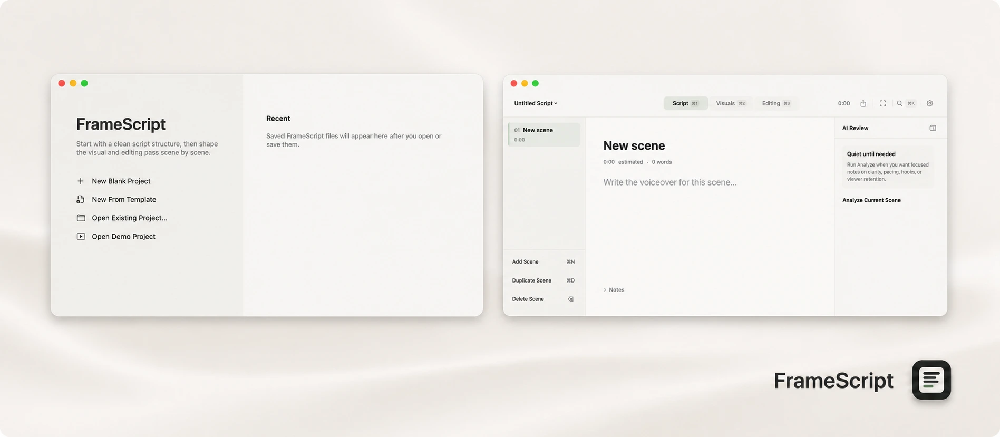

# FrameScript



FrameScript is a native macOS app for writing YouTube scripts as structured production scenes. Each scene keeps its script, Visuals plan, editing notes, AI review comments, and duration estimate together.

Current release: FrameScript v0.4.0.

## Install FrameScript

[Download FrameScript for macOS](https://github.com/Drash-ko/frame-script/releases/latest/download/FrameScript.dmg) (macOS 14.0 or later; Apple Silicon and Intel).

1. Download `FrameScript.dmg` and open it.
2. Drag FrameScript to Applications.
3. Launch FrameScript from Applications.

The v0.4.0 download is ad-hoc signed and is not Apple-notarized. On first launch, Control-click FrameScript in Applications, choose **Open**, then confirm **Open**. If macOS still blocks it, use **System Settings → Privacy & Security → Open Anyway** and confirm the app came from this repository.

The [ZIP fallback](https://github.com/Drash-ko/frame-script/releases/latest/download/FrameScript.zip) and [SHA-256 checksums](https://github.com/Drash-ko/frame-script/releases/latest/download/SHA256SUMS.txt) are published with the DMG.

## Features

- Scene-based Script, Visuals, and Editing workspaces with English and Russian interface strings.
- A disposable five-scene built-in product showcase in English and Russian, including production plans, editing direction, and prepared local review notes.
- Configurable keyboard shortcuts with recording, conflict reassignment, explicit unassignment, reserved-shortcut protection, and immediate updates to menus and visible keycaps. Letter shortcuts execute by physical key position, independently of the active keyboard layout.
- Anchor-first Visuals and Editing relationships. Ordinary unambiguous script edits keep selections and production markers aligned; links are cleared when a substantial rewrite cannot be repaired safely.
- Live word counts and scene, sidebar, and project duration estimates; saved projects coalesce rapid changes into one autosave.
- Project save/open using `.fscr` format version 3. FrameScript reads versions 1–3 and still imports legacy `.framescript` files.
- Export as plain text, Markdown, CSV, or a production outline.
- AI review, rewrites, inline autocomplete, and production suggestions for OpenAI-compatible endpoints, OpenRouter, Groq, and Google AI Studio. Inline autocomplete can be enabled in Settings, shows at most one complete sentence, accepts with Tab, and dismisses with Escape.
- Provider API keys stored in the macOS Keychain, never in project files.

## Developer Setup

Requirements: macOS 14.0 or later and Xcode with Swift 6 and a compatible macOS SDK.

```sh
open FrameScript.xcodeproj
```

Select the `FrameScript` scheme, choose `My Mac`, and press `Cmd+R`.

## Project Structure

```text
FrameScript.xcodeproj
FrameScript/
  App/                 App entry, shell, state, dependencies
  Components/          Shared toolbar, sidebar, form, editor UI
  Core/                Theme, localization, duration utilities
  Features/            Workspace, AI, Settings, and command features
  Models/              Document models, settings, templates, demo data
  Services/            AI, export, file storage, Keychain
  Assets.xcassets      App icon and assets
docs/
  banner.webp          README banner
scripts/
  package-release.sh   Verified DMG/ZIP release packaging
```

Built-in templates are defined in `FrameScript/Models/SampleData.swift`.

## Privacy and Security

Project files contain project content only. AI provider keys entered in Settings are stored in the macOS Keychain and stay out of UserDefaults, project files, exports, logs, and source-controlled configuration. FrameScript reads a selected provider key only for a connection test or AI request, caches it in process memory, and invalidates the cache when the key is replaced or deleted.

AI review validates structured provider responses before display, and existing review notes remain visible while a new analysis runs or if it fails. See `SECURITY.md` for reporting guidance.

## Known Limitations

- The v0.4.0 public download is not notarized and requires explicit first-launch confirmation.
- Inline review markers are not yet exposed in the editor.
- Production anchors cannot always survive arbitrary or completely ambiguous rewrites of linked text.
- AI capabilities require network access, a compatible provider account, and access to the configured model.
- FrameScript does not provide automatic updates.

## License

FrameScript is released under the MIT License. See `LICENSE` for details.
