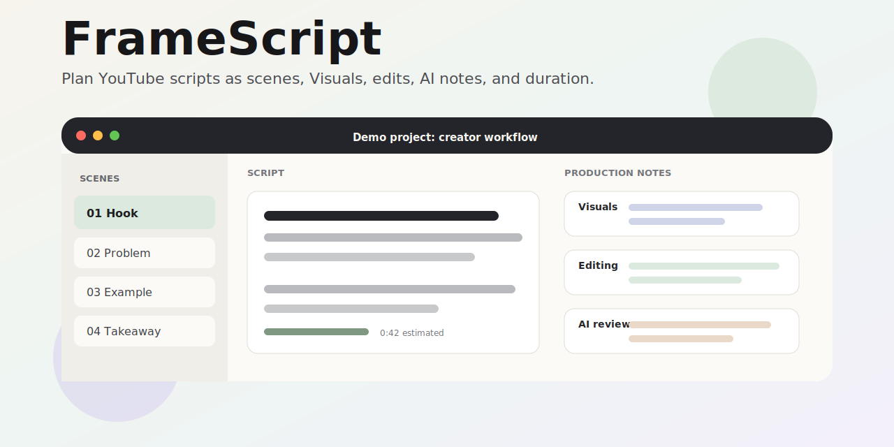

# FrameScript



FrameScript is a native macOS SwiftUI app for writing YouTube scripts as structured production scenes. A scene keeps the voiceover script, Visuals plan, editing notes, AI review comments, and estimated duration together so writing and production planning stay in one focused workspace.

This repository contains the FrameScript v0.3.0 release.

## Status

FrameScript is an early demo. The core app shell, local project format, templates, Script/Visuals/Editing workspaces, export renderer, and Keychain-backed AI configuration are implemented.

## Requirements

- macOS 14.0 or later
- Xcode with Swift 6 and a macOS SDK that supports a 14.0 deployment target

## Run

```sh
open FrameScript.xcodeproj
```

Then select the `FrameScript` scheme, choose `My Mac`, and press `Cmd+R`.

## Features

- Scene-based script editor with English and Russian UI strings.
- Live word counts and scene, sidebar, and project duration estimates update from each edit, independently of saving; saved projects still coalesce rapid edits into a single autosave.
- Script, Visuals, and Editing workspaces over the same scene structure.
- Visuals and Editing links persist exact text anchors, so ordinary insertions and deletions immediately keep the linked selection and Script markers aligned. Linked items are grouped by their exact anchored excerpt, anchor-only items remain linked, and legacy segment-only links are migrated when a project is loaded.
- Built-in templates for blank, standard YouTube, educational, storytelling, product review, commentary/essay, and tutorial projects.
- Project save/open using `.fscr` files. FrameScript writes project format version 3, reads versions 1–3, and continues to import legacy `.framescript` files.
- Export as plain text, Markdown, CSV, or production outline.
- AI review, rewrites, inline autocomplete, and production suggestions for OpenAI-compatible endpoints, OpenRouter, Groq, and Google AI Studio when configured with API keys. At the logical end of a script, autocomplete uses a short local context, shows at most one complete sentence as ghost text, accepts with Tab, and dismisses with Escape. AI output follows the script's dominant language, falling back to the resolved macOS language when the interface uses System.
- API keys are stored in the macOS Keychain, not in project files.

## Project Structure

```text
FrameScript.xcodeproj
FrameScript/
  App/                 App entry, shell, state, dependencies
  Components/          Shared toolbar, sidebar, form, editor UI
  Core/                Theme, localization, duration utilities
  Features/            Workspace, AI, Settings, and command features
  Models/              Observable document models, settings, built-in templates, demo data
  Services/            AI, export, file storage, Keychain
  Assets.xcassets      App icon and assets
docs/
  banner.svg           README banner
```

Built-in templates are defined in `FrameScript/Models/SampleData.swift`.

## Privacy And Security

FrameScript project files contain project content only. AI provider keys entered in Settings are stored in the macOS Keychain and stay out of UserDefaults, project files, exports, logs, and source-controlled configuration. FrameScript reads the selected provider's key for the first connection test or AI request in an app session, caches it only in process memory, and invalidates the cache when the key is replaced or deleted. Opening Settings consults saved-key metadata rather than reading the credential.

AI review validates structured provider responses before display, and existing review notes remain visible while a new analysis runs or if it fails.

## AI Connection Troubleshooting

FrameScript supports OpenAI-compatible endpoints, OpenRouter, Groq, and Google AI Studio. If a connection test fails, verify that the selected provider matches the key, the model identifier is available to that account, and any custom base URL ends at the provider's OpenAI-compatible API root. Authentication errors indicate an invalid or unauthorized key, model-unavailable errors indicate an incorrect or inaccessible model, and rate-limit errors should be retried after the provider's limit resets. Re-saving a key explicitly replaces its existing Keychain entry.

Before publishing builds or branches, keep generated files out of Git:

- `DerivedData/`
- `.build/`
- `.swiftpm/`
- `.env*`
- provisioning profiles, certificates, and private keys
- generated repository dumps such as `repomix-output.md`

See `SECURITY.md` for reporting guidance.

## Known Limitations

- Inline review markers are not yet exposed in the editor.
- Production links are cleared when a substantially rewritten selection cannot be repaired unambiguously.
- AI capabilities require network access, a compatible provider account, and access to the configured model.

## License

FrameScript is released under the MIT License. See `LICENSE` for details.
